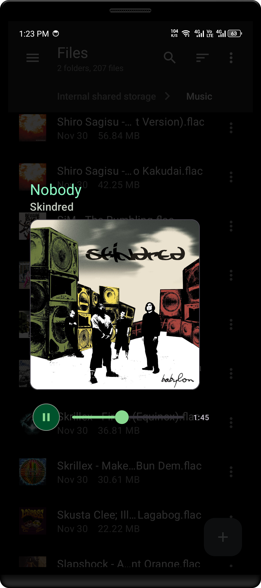

# Musicview
Quickly preview audio files without leaving, on Android.

## Overview


Musicview is designed to integrate seamlessly with other apps through intent-filters,
enabling users to preview audio files directly from various external sources.

It aims to provide a simple & user-friendly interface with the design following the
Material 3 guidelines, and powered by Media3 ExoPlayer to handle audio playback.

## Download
[](https://github.com/feivegian/musicview/actions/workflows/android.yml)

Get the [latest version](https://github.com/feivegian/musicview/releases/latest) on the Releases page.

## Building
It's the same way as you build a project using Android Studio, no steps needed.

Although if you prefer the command-line for building, you can use Gradle tasks instead:
```shell
# DEBUG
$ ./gradlew assembleDebug
$ ./gradlew installDebug # install to connected device
# RELEASE
$ ./gradlew assembleRelease
$ zipalign -v -p 4 app-release-unsigned.apk app-release-unsigned-aligned.apk
$ apksigner sign --ks my-release-key.jks --out app-release.apk app-release-unsigned-aligned.apk
```

> [!IMPORTANT]
> *When building a release build, you must provide your own keystore.*

## FAQ
- Musicview no longer accepts network playback, what happened?
> It has been removed starting with version **3.4.0**, due to overcomplicating reasons
> and security issues/concerns.
- Where is the old Music project? Why was this renamed to Musicview?
> Naming this project "Music" deemed confusing as it conflicts with devices
> that come with their stock music players, so "Musicview" is the new name for it.
- What are the supported audio formats?
> Any kind of format that is currently supported by Media3 ExoPlayer.

## License
This project is licensed under the [MIT License](LICENSE).
